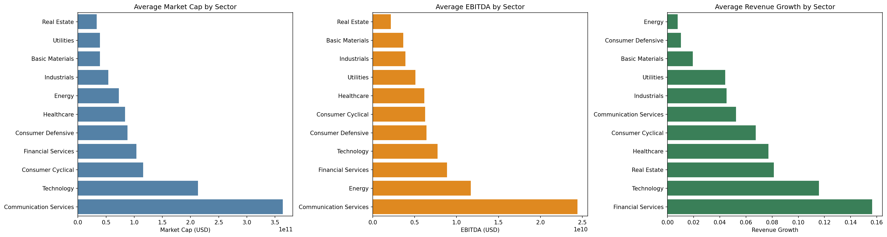

# S-P-500-Sector-Analysis

Analysis of S&P 500 sector performance using market cap, EBITDA, and revenue growth data.

## Overview

This project analyzes financial data for S&P 500 companies grouping them by sector to compare average market cap, profitability (EBITDA), and revenue growth. The goal here is to identify which sectors are largest, most profitable, and fastest-growing.

## Tools Used

Python, Pandas, Matplotlib and Seaborn

## Process

- Data collection — Sourced company-level financial data (sector, market cap, EBITDA, revenue growth) for S&P 500 companies.
- Data cleaning — Removed rows with missing EBITDA or revenue growth values (this changed from 502 to 470 companies).
- Aggregation — Grouped companies by sector and calculated average market cap, EBITDA, and revenue growth.
- Visualization — Built horizontal bar charts comparing all 11 sectors across each metric.

## Key Findings

- Communication Services has the highest average market cap ($364B) which is more than 70% larger than Technology ($213B), the second-highest sector.
- Financial Services leads in revenue growth (15.7%), despite ranking only 8th in average market cap.
- Energy and Consumer Defensive show the lowest revenue growth (under 1%), consistent with their status as mature, stable sectors.
- Technology combines high EBITDA ($7.7B avg) with strong revenue growth (11.6%), suggesting it's both large-scale and still expanding.
- Real Estate has the smallest average market cap ($33B) and lowest average EBITDA ($2.2B) among all 11 sectors.

## Sector Summary Table

| Sector | Market Cap (avg) | EBITDA (avg) | Revenue Growth (avg) |
|---|---|---|---|
| Basic Materials | $39,297,863,749.82 | $3,643,587,456.00 | 0.02 |
| Communication Services | $363,616,948,467.81 | $24,414,190,960.76 | 0.05 |
| Consumer Cyclical | $115,860,959,418.18 | $6,235,455,206.40 | 0.07 |
| Consumer Defensive | $87,941,583,318.49 | $6,398,984,998.05 | 0.01 |
| Energy | $72,666,901,666.91 | $11,703,289,893.82 | 0.01 |
| Financial Services | $104,085,439,636.21 | $8,869,586,042.95 | 0.16 |
| Healthcare | $83,716,625,721.81 | $6,161,792,758.58 | 0.08 |
| Industrials | $53,780,024,890.51 | $3,902,159,834.06 | 0.05 |
| Real Estate | $33,187,798,186.67 | $2,150,882,401.07 | 0.08 |
| Technology | $213,162,814,173.23 | $7,719,694,244.54 | 0.12 |
| Utilities | $39,292,805,440.00 | $5,087,529,688.00 | 0.04 |

## Visualizations



## How to Run

```bash
pip install pandas matplotlib seaborn
python read.py
```

## Data Source

Data was collected from S&P 500 company financial data sourced from Kaggle.
